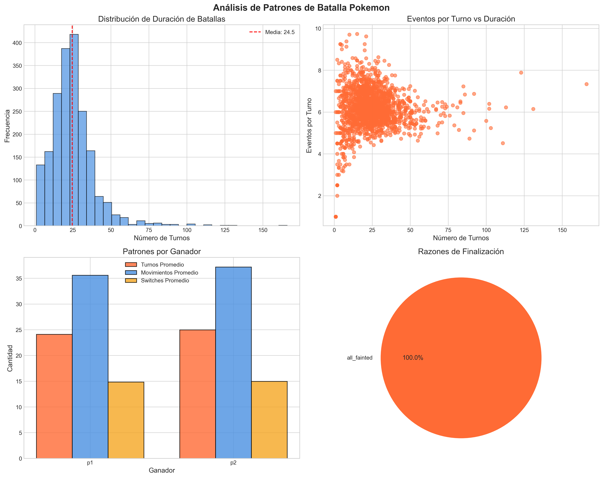

# 🔥 Pokemon Battle AI - El Camino hacia el Maestro Definitivo

[](https://www.python.org/)
[](https://pytorch.org/)
[](https://pytorch.org/)
[](https://scikit-learn.org/)
[](LICENSE)
[](notebooks/)
[](README.md)
[](output/baseline_model_performance.png)



## 🎯 La Misión Épica: Crear el Maestro Pokemon Definitivo

**Un agente de Reinforcement Learning que juega batallas Pokemon, aprende de cada decisión y evoluciona continuamente.** Este no es un simple predictor: es un **entrenador artificial** que toma decisiones en tiempo real, explora estrategias, comete errores, aprende de ellos y mejora hasta alcanzar el nivel de los mejores jugadores humanos.

### 🌟 La Visión Final

- ✨ **Juega batallas completas** tomando decisiones turno a turno
- 🧠 **Aprende de cada acción** mediante Reinforcement Learning
- 🔄 **Se entrena mediante self-play** contra versiones de sí misma
- 📈 **Mejora continuamente** con cada batalla jugada
- 🎯 **Explica sus decisiones** con razonamiento estratégico
- 🏆 **Compite contra humanos** y aprende de maestros Pokemon

## 📊 El Arsenal de Datos: La Memoria de 14,000 Batallas

**La Biblioteca Completa de Experiencia Pokemon:**

- **Fuente**: Batallas reales de Pokemon Showdown (formato gen9randombattle)
- **Escala**: ~14,000 batallas individuales con logs completos
- **Formato**: JSON estructurado con secuencias de decisiones turno a turno

## 📌 Resultados actuales (dataset completo)

- Baseline ROC-AUC 0.837 (dataset completo). Ver `output/baseline_model_performance.png`.

### 🎮 Base de Datos Pokemon (`pokemon_data.py`)

**El corazón del sistema de type matchups:**

- **200+ Pokemon** con especies mapeadas (Gen 1-9)
- **Matriz 18x18** de efectividad de tipos completa
- **Base Stat Totals (BST)** para todos los Pokemon
- **Tiers competitivos**: Uber, OU, UU, RU
- **Funciones helper**: `get_pokemon_types()`, `get_pokemon_bst()`, `calculate_matchup_score()`

**Especies incluidas:**

- ✅ Todos los starters (Gen 1-9)
- ✅ Todos los legendarios principales
- ✅ Todos los pseudo-legendarios
- ✅ Pokemon competitivos populares
- ✅ Gen 9 completo (Paldea)

## 🚀 Arquitectura del Sistema: Del Análisis al Agente

### 🔬 Fase 1: Fundamentos (Completado)

**Sistema de Predicción (Baseline):**

- ✅ Pipeline de datos: JSON → Features → Baseline ligero (p.ej., Logistic Regression)
- ✅ Métrica principal: ROC-AUC (baseline de referencia)
- ✅ Visualizaciones temáticas Pokemon (EDA)
- ✅ Base de datos Pokemon con tipos y BST
- 📝 **Resultado**: Predicción funcional, patrones identificados

### 🤖 Fase 2-4: Agente RL (Roadmap)

- Agente DQN/PPO con PyTorch y memoria de experiencias.
- Entorno estilo Gym basado en estados de Showdown y acciones válidas.
- Recompensas: victoria/derrota + shaping estratégico.
- Entrenamiento: self-play, checkpoints, evaluación continua.
- Análisis: winrate y estrategias aprendidas vs humanos/baselines.

## 🏗️ Estructura del Proyecto

### Estructura actual

```text
Pokemon_battle/
├── src/
│   ├── agents/
│   │   ├── base_agent.py
│   │   └── random_agent.py
│   ├── data/
│   │   ├── feature_extractor.py
│   │   └── pokemon_data.py
│   ├── environment/
│   └── models/
│       └── networks.py
├── config/
│   └── config.py
├── data/
│   ├── battles/
│   └── archive.zip
├── notebooks/
│   └── EDA_notebook_ready.ipynb / .py
├── assets/
│   └── images/
├── output/
├── tests/
└── README.md
```

## 🛠️ Instalación y Configuración

### Prerrequisitos

- Python 3.8+
- Git
- 4GB RAM mínimo (8GB recomendado)
- GPU opcional (para entrenamiento acelerado)

### Instalación Completa

```bash
# Clonar repositorio
git clone https://github.com/AlexGHerrera/Pokemon-battle-ai.git
cd Pokemon-battle-ai

# Crear entorno virtual
python -m venv venv
source venv/bin/activate  # Linux/Mac
# venv\Scripts\activate  # Windows

# Instalar dependencias
pip install -r requirements.txt

# Crear directorios necesarios
python config/config.py
```

### Variables de Entorno (Opcional)

```bash
# .env
USE_GPU=true          # Usar GPU para entrenamiento
DEBUG=false           # Modo debug del servidor
DATA_SAMPLE_SIZE=2000 # Tamaño de muestra para desarrollo
```

## 🚀 Guía de Uso

### 📊 Fase 1: Toma de Contacto (Completado)

**1. Análisis Exploratorio de Datos:**

```bash
# Ejecutar EDA completo
jupyter lab notebooks/EDA_notebook_ready.ipynb
```

**Qué descubrirás:**

- Patrones de victoria en 14,000+ batallas
- Correlaciones clave entre features válidas

### 🔬 Fase 2: Análisis de Decisiones (Próximo Paso)

**Crear notebook de análisis de decisiones:**

```bash
# Analizar decisiones turno a turno
jupyter lab notebooks/EDA_Decision_Analysis.ipynb
```

**Objetivos:**

- Extraer secuencias (estado, acción, resultado)
- Diseñar espacio de estados y acciones para RL

## 📊 Componentes del Sistema

### Fase 1 (Implementado)

- ✅ **FeatureExtractor** (`src/data/feature_extractor.py`): Extracción de features válidas
- ✅ **Type Matchup System**: Cálculo de efectividad elemental 18x18
- ✅ **EDA Visualization Suite**: Gráficos temáticos y análisis exploratorio

### Fase 2+ (A Implementar)

- ⏸️ **BattleParser**: Secuencias de decisiones para RL
- ⏸️ **PokemonBattleEnv**: Entorno Gym con acciones válidas
- ⏸️ **DQNAgent / PPOAgent**: Agentes de RL
- ⏸️ **RLTrainer**: Entrenamiento con self-play y evaluación

### Archivos Generados

**Fase 1:**

- `output/battle_features.csv` - Features extraídas
- `output/*.png` - Visualizaciones EDA

**Fase 3+ (Futuro):**

- `data/rl_experiences/` - Experiencias del agente
- `src/models/pretrained/agent_*.pth` - Checkpoints del agente
- `logs/training_*.log` - Logs de entrenamiento RL

## 🎯 Visualizaciones clave

- `assets/images/battle_patterns_analysis.png` — Ritmo de batalla y eventos.
- `assets/images/type_analysis.png` — Fuerzas elementales y winrates por tipo.
- `assets/images/correlation_matrix_filtered.png` — Relaciones entre features válidas.

## 📈 Roadmap: El Camino hacia el Maestro Pokemon

### ✅ Fase 1: Toma de Contacto (Completado)

**Objetivo:** Entender el dominio y validar que los patrones existen

- ✅ EDA de 14,000+ batallas
- ✅ Sistema de type matchups
- ✅ Base de datos Pokemon (200+ especies)
- ✅ Visualizaciones temáticas
- 📝 **Conclusión:** Los patrones de victoria son predecibles

### 🔄 Fase 2: Análisis de Decisiones (En Progreso)

**Objetivo:** Entender qué decisiones llevan a la victoria

- 🎯 Crear `EDA_Decision_Analysis.ipynb`
- 🔍 Extraer secuencias (estado, acción, resultado) de batallas
- 🧠 Analizar movimientos exitosos por situación
- 📊 Identificar patrones en secuencias de acciones
- 🎮 Diseñar espacio de estados y acciones para RL
- 📈 Estudiar estrategias de jugadores top vs random

### ⏸️ Fase 3: Primer Agente RL (Pendiente)

**Objetivo:** Crear un agente que aprenda a jugar desde cero

1. **Implementar Entorno de Batalla**
   - Gym environment compatible con OpenAI Gym
   - Representación de estados de batalla
   - Sistema de acciones válidas
   - Cálculo de recompensas

2. **Implementar Agente DQN**
   - Red neuronal para Q-values
   - Replay buffer para experiencias
   - Target network para estabilidad
   - Epsilon-greedy para exploración

3. **Sistema de Self-Play**
   - Entrenamiento agente vs agente
   - Guardado de checkpoints
   - Monitorización de progreso
   - Evaluación contra baselines

4. **Integración con Pokemon Showdown**
   - API para jugar batallas reales
   - Parser de estados de batalla
   - Sistema de acciones

**🎯 Objetivo:** Winrate > 50% contra jugadores random

### ⏸️ Fase 4: Evolución y Maestría (Futuro)

**Objetivo:** Alcanzar nivel competitivo humano

1. **Algoritmos Avanzados**
   - PPO (Proximal Policy Optimization)
   - A3C (Asynchronous Actor-Critic)
   - AlphaZero-style (MCTS + Neural Networks)

2. **Mejoras de Arquitectura**
   - Attention mechanisms para focus en Pokemon clave
   - LSTM para memoria de secuencias
   - Embeddings de Pokemon y movimientos

3. **Curriculum Learning**
   - Empezar contra oponentes débiles
   - Incrementar dificultad progresivamente
   - Aprender de jugadores humanos top

4. **Explicabilidad**
   - Visualización de decisiones
   - Análisis de estrategias aprendidas
   - Generación de narrativas de batalla

**🎯 Objetivo:** ELO 1500+ en Pokemon Showdown

## 🤝 Contribuir

1. Fork el repositorio
2. Crea una rama para tu feature (`git checkout -b feature/nueva-funcionalidad`)
3. Commit tus cambios (`git commit -am 'Añadir nueva funcionalidad'`)
4. Push a la rama (`git push origin feature/nueva-funcionalidad`)
5. Crea un Pull Request

## 📄 Licencia

Este proyecto está bajo la Licencia MIT - ver el archivo [LICENSE](LICENSE) para detalles.

## 👥 Autores

- **Alejandro Guerra Herrera** - *Desarrollo inicial* - [GitHub](https://github.com/AlexGHerrera)

## 🙏 Agradecimientos Épicos

- **Pokemon Showdown** por ser la fuente de nuestras 14,000+ batallas épicas
- **Comunidad Pokemon competitivo** por crear las estrategias que analizamos
- **HackABoss** por proporcionar el escenario para esta aventura épica
- **Satoshi Tajiri** por crear el universo Pokemon que inspiró este proyecto
- **Todos los entrenadores** cuyas batallas alimentan nuestros algoritmos

### 🎭 **Filosofía del Proyecto**

> *"En cada dataset hay una historia esperando ser contada. En cada algoritmo hay un gladiador esperando su momento de gloria. En cada predicción hay una decisión que puede cambiar el curso de una batalla."*
>
> **— El Manifiesto del Pokemon Battle AI**

## 📞 Contacto

Para preguntas o colaboraciones:

- **Email**: <alex_gh@live.com>
- **LinkedIn**: [Alejandro Guerra Herrera](https://www.linkedin.com/in/alejandro-guerra-herrera-a86053115/)
- **GitHub**: [@AlexGHerrera](https://github.com/AlexGHerrera)

---

## 🌟 **¡Únete a la Leyenda!**

⭐ **¡Dale una estrella si este proyecto épico te ha inspirado!** ⭐

**¿Te atreves a crear un agente que aprenda a jugar Pokemon?**  
**¿Lograrás que supere a jugadores humanos?**  
**¿Descubrirás estrategias que ni los maestros Pokemon conocen?**

### 🔥 **La aventura apenas comienza...**

*Fase 1 completada: Sabemos que los patrones existen.*  
*Fase 2 en progreso: Entendiendo las decisiones ganadoras.*  
*Fase 3+: Crear el agente que juegue y aprenda.*

**¡El camino hacia el Maestro Pokemon AI está trazado!** 🚀
