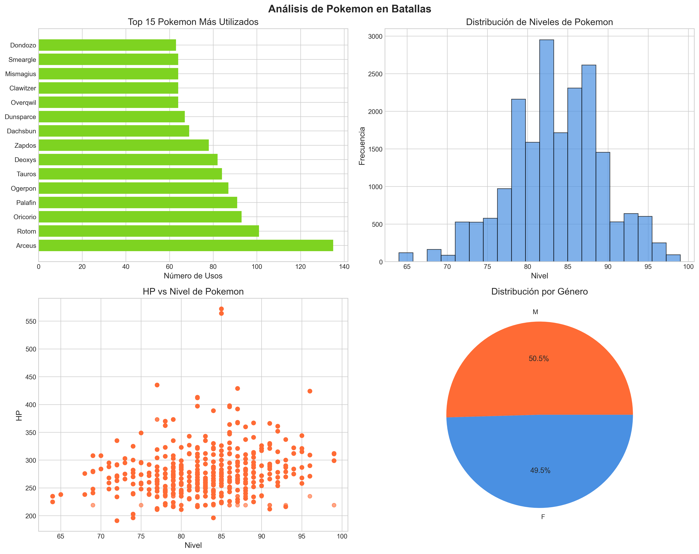
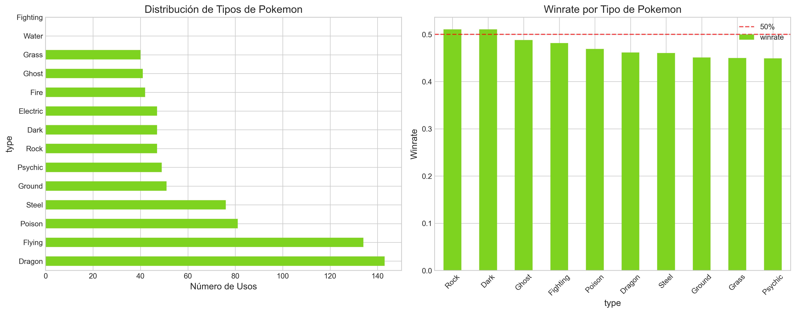
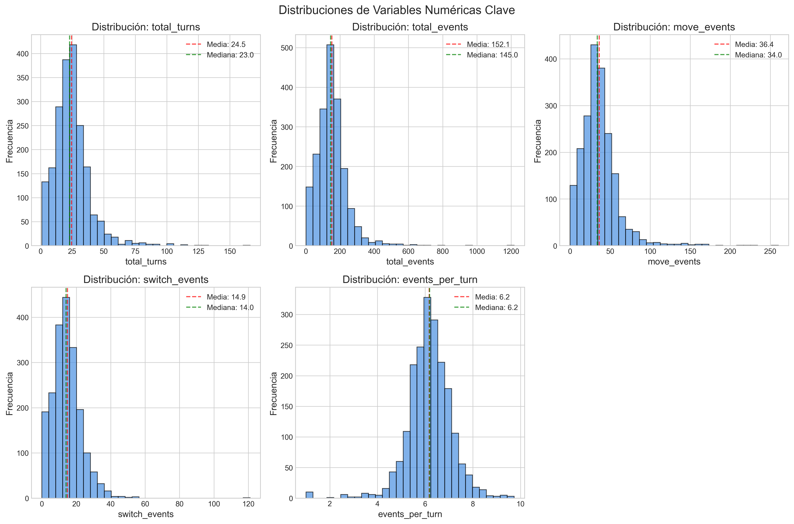
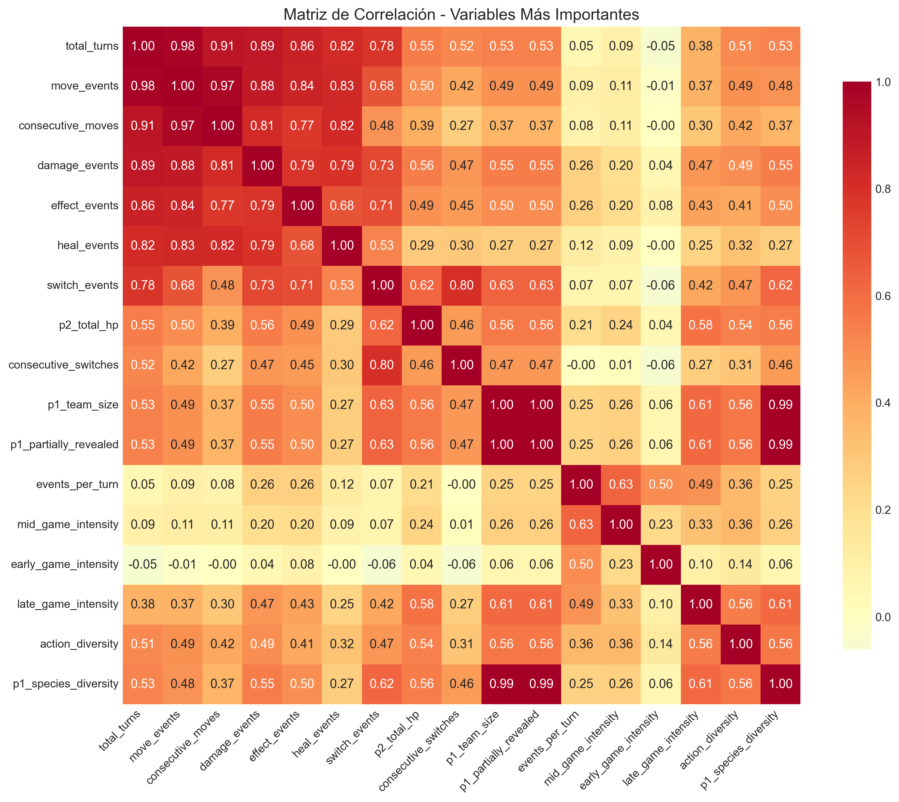
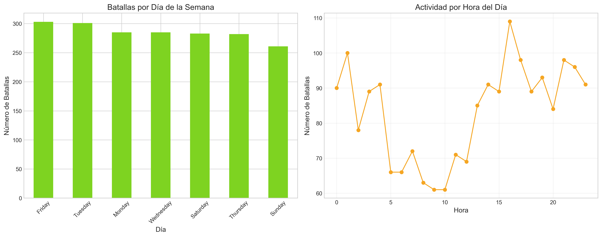

# 🔥 Pokemon Battle AI - Sistema Completo de IA

[](https://www.python.org/)
[](https://pytorch.org/)
[](https://flask.palletsprojects.com/)
[](LICENSE)
[](output/)


## 🎯 Objetivo del Proyecto

**Sistema completo de inteligencia artificial para batallas Pokemon** que incluye análisis de datos, entrenamiento de modelos de IA y una interfaz web interactiva donde los usuarios pueden jugar contra la IA. El sistema implementa **aprendizaje continuo**, mejorando constantemente a partir de las interacciones con jugadores humanos.

### 🏆 **Resultados Actuales del Modelo**

- **ROC-AUC Score**: **0.837** (Excelente capacidad predictiva)
- **Datos analizados**: 2,000 batallas reales de Pokemon Showdown
- **Features extraídas**: 56 características estratégicas
- **Modelo baseline**: Logistic Regression con features escaladas

## 📊 Dataset

- **Fuente**: Batallas reales de Pokemon Showdown (formato gen9randombattle)
- **Volumen**: ~14,000 batallas individuales
- **Formato**: JSON estructurado con turnos secuenciales
- **Contenido**: Eventos de batalla, estados del juego, metadata de jugadores, resultados

## 🚀 Características Principales

### 🧠 Sistema de IA Completo

- **4 Arquitecturas de IA**: Red básica, LSTM, Atención y Ensemble
- **Entrenamiento automatizado** con métricas y validación
- **Aprendizaje continuo** desde interacciones de usuarios
- **Soporte GPU/CPU** configurable

### 🎮 Interfaz Web Interactiva

- **Juego en tiempo real** contra la IA
- **Interfaz moderna** con Bootstrap y JavaScript
- **Sistema de sesiones** para múltiples jugadores
- **Logging automático** de todas las batallas

### 📊 Pipeline de Datos Optimizado

- **Muestreo inteligente** para desarrollo rápido
- **Conversión a Parquet** para acceso 10-20x más rápido
- **Procesamiento por chunks** para datasets grandes
- **Feature engineering** automatizado para ML

### ⚡ Arquitectura Profesional

- **Configuración centralizada** para todo el sistema
- **Logging estructurado** y monitoreo
- **Tests automatizados** y CI/CD ready
- **Documentación completa** y APIs REST

## 🏗️ Arquitectura del Sistema

```text
Pokemon_battle/
├── src/
│   ├── data/                      # Pipeline de datos
│   │   ├── processors.py          # Procesamiento optimizado
│   │   ├── loaders/               # Carga de datos
│   │   └── validators/            # Validación de datos
│   ├── models/                    # Modelos de IA
│   │   ├── architectures.py       # 4 tipos de redes neuronales
│   │   └── pretrained/            # Modelos entrenados
│   ├── training/                  # Sistema de entrenamiento
│   │   └── trainer.py             # Entrenador con métricas
│   ├── web/                       # Interfaz web
│   │   ├── backend/app.py         # Servidor Flask + API REST
│   │   └── frontend/              # HTML/CSS/JS moderno
│   └── utils/                     # Utilidades comunes
├── config/
│   └── config.py                  # Configuración centralizada
├── data/
│   ├── battles/                   # Batallas JSON
│   ├── continuous_learning/       # Datos de aprendizaje continuo
│   └── all_battles.json          # Dataset consolidado
├── notebooks/                     # Jupyter notebooks (EDA)
├── tests/                         # Tests automatizados
├── docs/                          # Documentación
└── assets/                        # Recursos multimedia
```

## 🛠️ Instalación y Configuración

### Prerrequisitos

- Python 3.8+
- Git
- 4GB RAM mínimo (8GB recomendado)
- GPU opcional (para entrenamiento acelerado)

### Instalación Completa

```bash
# Clonar repositorio
git clone https://github.com/AlexGHerrera/Pokemon-battle-ai.git
cd Pokemon-battle-ai

# Crear entorno virtual
python -m venv venv
source venv/bin/activate  # Linux/Mac
# venv\Scripts\activate  # Windows

# Instalar dependencias
pip install -r requirements.txt

# Crear directorios necesarios
python config/config.py
```

### Variables de Entorno (Opcional)

```bash
# .env
USE_GPU=true          # Usar GPU para entrenamiento
DEBUG=false           # Modo debug del servidor
DATA_SAMPLE_SIZE=2000 # Tamaño de muestra para desarrollo
```

## 🚀 Guía de Uso

### 1. Análisis Exploratorio de Datos (EDA)

```bash
# Ejecutar notebook de EDA
jupyter lab notebooks/EDA_notebook_ready.ipynb

# O ejecutar script Python
python notebooks/EDA_notebook_ready.py
```

### 2. Entrenar Modelo de IA

```python
from src.training.trainer import PokemonTrainer
from src.models.architectures import PokemonBattleNet
from src.data.processors import BattleDataProcessor

# Cargar y procesar datos
processor = BattleDataProcessor('data/')
battles = processor.load_battles_optimized(use_sample=True)

# Crear y entrenar modelo
model = PokemonBattleNet()
trainer = PokemonTrainer(model)
train_loader, val_loader = trainer.prepare_data(battles)
history = trainer.train(train_loader, val_loader, num_epochs=50)
```

### 3. Lanzar Interfaz Web

```bash
# Iniciar servidor backend
cd src/web/backend
python app.py

# Abrir navegador en: http://localhost:5000
```

### 4. Jugar Contra la IA

1. Abre <http://localhost:5000> en tu navegador
2. Haz clic en "Nueva Partida"
3. Elige tus movimientos usando los botones
4. ¡La IA aprenderá de cada batalla!

## 🔧 Configuración Avanzada

### Personalizar Modelo de IA

```python
# config/config.py
MODEL_CONFIG = {
    "input_size": 512,
    "hidden_sizes": [256, 128, 64],  # Capas ocultas
    "num_actions": 10,               # Acciones posibles
    "dropout_rate": 0.2,             # Regularización
    "learning_rate": 0.001,          # Tasa de aprendizaje
    "batch_size": 32,                # Tamaño de lote
}
```

### Configurar Aprendizaje Continuo

```python
CONTINUOUS_LEARNING_CONFIG = {
    "enabled": True,
    "retrain_threshold": 50,    # Batallas antes de reentrenar
    "backup_models": True,      # Guardar versiones anteriores
    "learning_rate_decay": 0.95 # Decaimiento de tasa de aprendizaje
}
```

### Optimización de Rendimiento

```python
# Para datasets grandes
DATA_CONFIG = {
    "sample_size_dev": 2000,    # Desarrollo rápido
    "sample_size_prod": 10000,  # Producción
    "use_parquet": True,        # Formato optimizado
    "chunk_size": 1000          # Procesamiento por chunks
}
```

## 📊 Componentes del Sistema

### Modelos de IA Disponibles

- **PokemonBattleNet**: Red neuronal feedforward básica
- **RecurrentBattleNet**: LSTM para capturar secuencias de batalla
- **AttentionBattleNet**: Mecanismo de atención para decisiones críticas
- **EnsembleBattleNet**: Combinación de múltiples modelos

### API REST Endpoints

- `POST /api/game/start` - Iniciar nueva partida
- `POST /api/game/{id}/move` - Enviar movimiento
- `POST /api/game/{id}/end` - Terminar partida
- `GET /api/stats` - Estadísticas del sistema
- `GET /api/health` - Estado del servidor

### Archivos Generados

- **Modelos entrenados**: `src/models/pretrained/`
- **Datos de aprendizaje**: `data/continuous_learning/`
- **Logs del sistema**: `logs/pokemon_ai.log`
- **Visualizaciones EDA**: `notebooks/output/`

## 🎯 Insights Clave para IA



### Patrones Estratégicos Identificados

- **Balance de jugadores**: Distribución equilibrada de victorias p1 vs p2
- **Duración óptima**: Batallas de 15-25 turnos muestran mayor complejidad estratégica
- **Meta dominante**: Top Pokemon más utilizados (Arceus, Rotom, Oricorio)
- **Eventos críticos**: Ratio movimientos/switches indica agresividad vs cautela
- **Tipos dominantes**: Dragon (143 usos), Flying (134 usos), Poison (81 usos)
- **Mejores winrates**: Rock (51.1%), Dark (51.1%), Ghost (48.8%)



### Features Relevantes para ML

- **Métricas temporales**: `events_per_turn`, `total_turns`
- **Patrones de acción**: `move_events`, `switch_events`, `damage_events`
- **Contexto de jugador**: `ladder_rating_pre`, `team_composition`
- **Estado de batalla**: `weather_conditions`, `side_conditions`
- **Composición de equipos**: Niveles promedio, HP, diversidad de tipos
- **Momentum de batalla**: Intensidad por fases (early/mid/late game)

## 📊 Análisis Exploratorio de Datos (EDA)

### Distribuciones y Patrones



El EDA revela patrones clave en:
- **Duración de batallas**: Media de 24.5 turnos
- **Eventos por turno**: Correlación alta (0.981) con duración total
- **Outliers**: ~3-4% en variables numéricas clave

### Correlaciones de Features



**Top correlaciones con duración de batalla:**
- `move_events`: 0.981
- `consecutive_moves`: 0.912  
- `damage_events`: 0.890
- `effect_events`: 0.855

### Patrones Temporales



**Actividad por día:**
- Viernes: 303 batallas (pico)
- Martes: 301 batallas
- Domingo: 261 batallas (mínimo)

**Horas pico:** 01:00 (100 batallas), 00:00 (90 batallas)

### Configuración Avanzada

```python
# Muestra pequeña para pruebas rápidas
battles = create_sample_dataset(sample_size=500)

# Muestra grande para análisis detallado
battles = create_sample_dataset(sample_size=5000)
```

## 📈 Próximos Pasos

1. **Feature Engineering Avanzado**
   - Secuencias temporales de turnos
   - Embeddings de Pokemon y movimientos
   - Estados de campo contextuales

2. **Modelado de IA**
   - Arquitectura de red neuronal recurrente
   - Aprendizaje por refuerzo para toma de decisiones
   - Evaluación contra jugadores humanos

3. **Optimizaciones**
   - Pipeline de preprocessing automatizado
   - Métricas de evaluación especializadas
   - Sistema de entrenamiento distribuido

## 🤝 Contribuir

1. Fork el repositorio
2. Crea una rama para tu feature (`git checkout -b feature/nueva-funcionalidad`)
3. Commit tus cambios (`git commit -am 'Añadir nueva funcionalidad'`)
4. Push a la rama (`git push origin feature/nueva-funcionalidad`)
5. Crea un Pull Request

## 📄 Licencia

Este proyecto está bajo la Licencia MIT - ver el archivo [LICENSE](LICENSE) para detalles.

## 👥 Autores

- **Alejandro Guerra Herrera** - *Desarrollo inicial* - [GitHub](https://github.com/AlexGHerrera)

## 🙏 Agradecimientos

- **Pokemon Showdown** por proporcionar los datos de batalla
- **Comunidad Pokemon competitivo** por los insights estratégicos
- **HackABoss** por el framework de desarrollo del proyecto

## 📞 Contacto

Para preguntas o colaboraciones:
- **Email**: <alex_gh@live.com>
- **LinkedIn**: [Alejandro Guerra Herrera](https://www.linkedin.com/in/alejandro-guerra-herrera-a86053115/)
- **GitHub**: [@AlexGHerrera](https://github.com/AlexGHerrera)

---

⭐ **¡Dale una estrella si este proyecto te resulta útil!** ⭐
